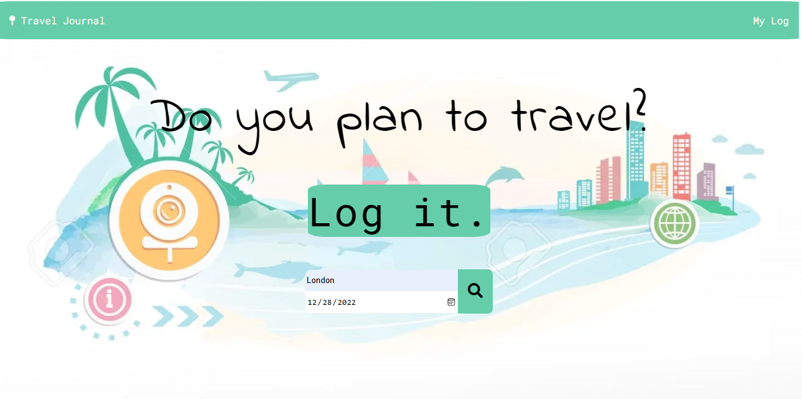
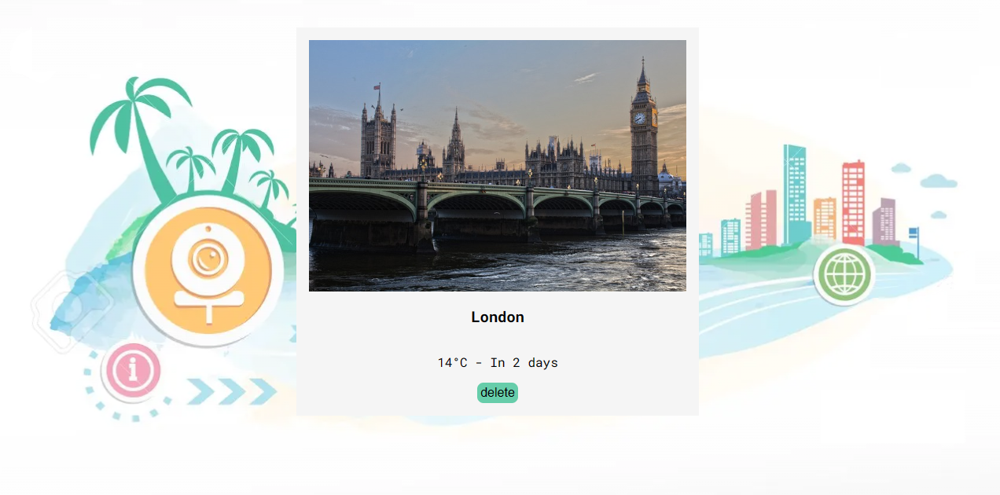

# Project: FEND Capstone - Travel App


# project description:

This is a one page web app, which includes a simple form where you enter the location you are traveling to and the date you are leaving. 

It works by getting the desired flight location and date from the user, then displaying the weather and a picture of the location using information obtained from external APIs.

# Technologies and Languages Used:

- Front-end:
  - HTML
  - Sass
  - Javascript
- Backend-Server:
  - Express(NodeJS)
  - Async/Await


# To start the project:
## Start with API 

### In order to run this application locally make sure you signup to:

- [Geonames](https://www.geonames.org/)
- [Weatherbit](https://www.weatherbit.io/api)
- [Pixabay](https://pixabay.com/api/docs/)

You will need to create a new `.env` file in the root of your project and store your API keys like so:

```
WEATHERBIT_KEY = ********************
PIXABAY_KEY = ***********************
GEONAMES_USER = *********************
```

Run the command:
- ` $ npm i`
- ` $ npm run build-prod`
## Run in development mode:

To start the webpack dev server at port 8080
- ` $ npm run build-dev`

Start back-end serve
- `npm run start`

## Testing

Testing is done with Jest. To run test, use the command

`npm run test`

## Image for result:
### Home:


### Result:


### Save:


